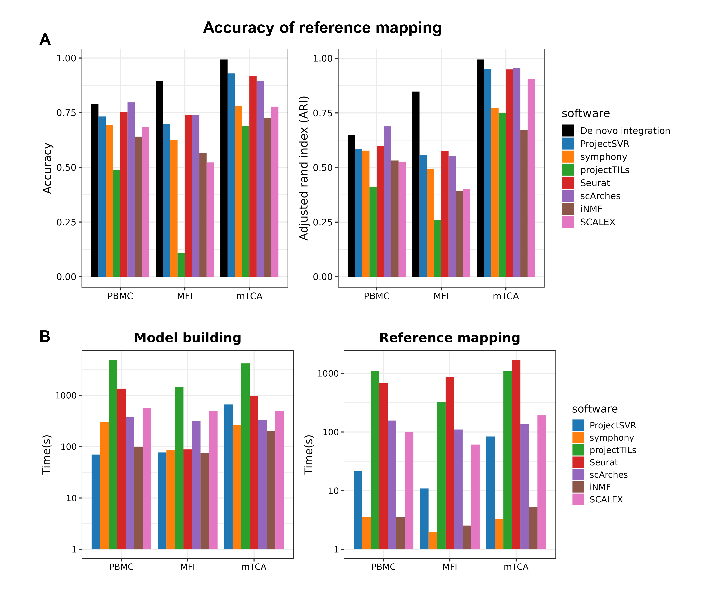

# Benchmark results of ProjectSVR and other reference mapping algorithms

## Involved datasets

- DISCO blood atlas (PBMC)
- Maternal fetal interface (MFI)
- Mouse testicular cell atlas (mTCA)

see https://github.com/JarningGau/ProjectSVR#related-resources for details.

## Involved methods

- [ProjectSVR](https://github.com/JarningGau/ProjectSVR)
- [Symphony](https://github.com/immunogenomics/symphony)
- [Seurat V4](https://github.com/satijalab/seurat)
- [ProjecTILs](https://github.com/carmonalab/ProjecTILs)
- [scArches](https://github.com/theislab/scarches)
- [online iNMF](https://github.com/welch-lab/liger)
- [SCALEX](https://github.com/jsxlei/SCALEX)

## Benchmark results

### Reference and query embeddings

### Summary metrics

